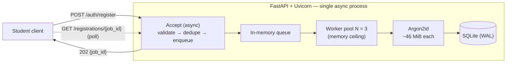
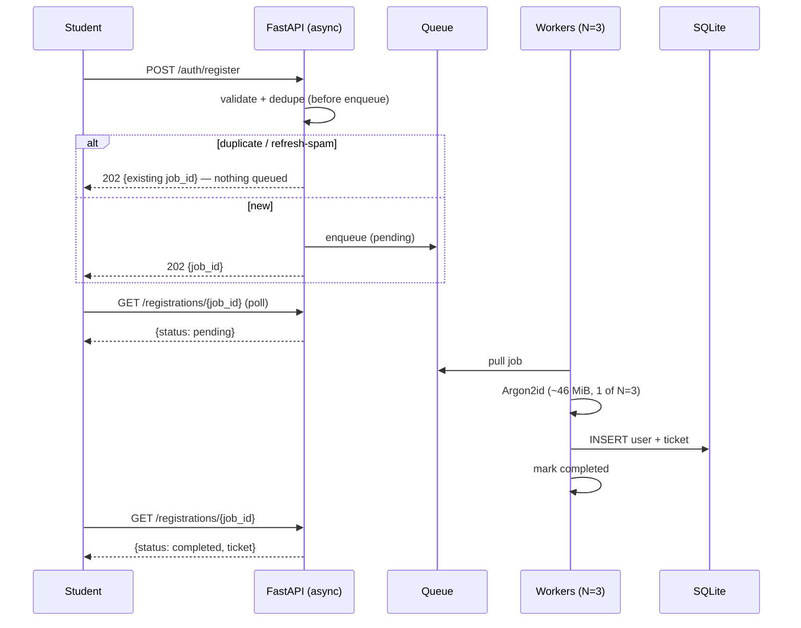

# SCALE.md — Surviving the Registration Spike

> **The question.** 2,000 students hit the registration endpoint within the first 60 seconds. The
> server has 1 GB of RAM. What is one concrete strategy to keep it stable during the spike?

## Assumptions

- **Hardware:** 1 GB RAM, **~2 vCPU** (typical small cloud instance; often burstable/shared).
- **Password hash:** **Argon2id** (OWASP-recommended), `m = 46 MiB, t = 1, p = 1` → ~46 MiB **and**
  ~one core per call.
- **Server:** async ASGI — **FastAPI + Uvicorn**, single process.
- **Queue:** in-memory (no Redis on a 1 GB box — see §6).
- **Baseline footprint:** OS + Python + Uvicorn + SQLite ≈ 250–350 MB, leaving **~450 MB for hashing**.
- **Registration is decoupled from payment** (payment is a separate later step), so a few seconds of
  registration processing delay is invisible in the real user journey.

## TL;DR

The bottleneck on 1 GB is **memory**, not request count — and it comes from one place: the
**memory-hard** Argon2id hash (~46 MiB each). So: **accept every request instantly on the async
loop, drop duplicates before they cost anything, queue the rest, and hash them with a small fixed
pool (N = 3) so peak memory is a constant far below 1 GB.**

---

## 1. The real bottleneck

`2,000 / 60 s ≈ 33 req/s` — trivial throughput. The cost is **hashing the password**.

> The thesis depends on the hash being **memory-hard**: Argon2id allocates ~46 MiB per call *by
> design* (to make brute-force expensive). bcrypt (~4 KiB) would make this **CPU-bound** instead — a
> different problem. Naming the algorithm *is* the premise.

The naive design dies before creating a single ticket:

| Naive choice | Under 2,000 at once | Result |
| --- | --- | --- |
| Unbounded hashing | `2,000 × 46 MiB ≈ 92 GB` | instant OOM |
| Thread-per-request (sync) | `2,000 × ~8 MiB stacks ≈ 16 GB` | OOM before hashing starts |

So two things must be controlled: **how many hashes run at once**, and **how connections are held**.

---

## 2. The strategy — a bounded async pipeline

Four decisions, each tied to the failure it prevents.

**1 — Async server.** The accept path is non-blocking, so 2,000 connections cost ~KB each on one
event loop, not a thread each (which would OOM, above). The hash never runs on the loop — it is
offloaded to the pool below.

**2 — Dedupe *before* enqueue.** Each queued job is a ~46 MiB liability. De-duping *after* the queue
lets a refresh (or scripted spam) pile 50 × 46 MiB of work → a memory-amplification DoS. So check the
email on accept; a duplicate returns the existing `job_id` and queues **nothing**. Backed by a
`UNIQUE` email constraint + a per-IP rate limit.

**3 — Bounded worker pool (the memory ceiling).** Argon2id runs *only* here. N is derived, not guessed:

| Limit | Calc | Value |
| --- | --- | --- |
| RAM-bound | `~450 MB ÷ 46 MiB` | ≈ 9 |
| CPU-bound | `cores + 1` (the +1 overlaps the DB write) | 3 |
| **N = min(RAM, CPU)** | `min(9, 3)` | **3** |

Peak hashing RAM = `3 × 46 MiB ≈ 138 MiB` — **constant for any arrival rate.** Note: N is a *ceiling*,
not an always-on throttle. At low traffic a lone request runs immediately (~80 ms); the cap only bites
when concurrency exceeds N. And because hashing is CPU-bound, **throughput is set by cores, not N** — a
larger N wouldn't drain faster on 2 cores, it would just waste RAM.

**4 — Queue + `202` + poll.** Accept → validate → dedupe → create job (`pending`) → enqueue → return
`202 {job_id}` in milliseconds. A worker later hashes, writes user + ticket to SQLite (WAL), and marks
the job `completed`. The client polls `GET /registrations/{job_id}` until done — that poll **is** the
loading screen. **Safety valve:** if the queue exceeds a sane cap, return `503 Retry-After` — degrade
gracefully instead of OOM (never fires at this scale; it's for a 10× surprise).

---

## 3. Diagrams

---

## 4. What happens on Friday at 6:00 PM

| Property | Behaviour |
| --- | --- |
| Acceptance | milliseconds for all 2,000; server responsive throughout |
| Dropped requests | zero |
| Peak memory | baseline + ~138 MiB hashing — never near 1 GB |
| Completion | throughput ≈ `cores ÷ hash_time ≈ 2 ÷ 80 ms ≈ 25/s` → worst-case tail ~80 s; spread across the minute, most finish in seconds |

**Acceptance is instant; completion is eventual.** "Stable" means it stays up, drops nothing, and
holds a flat memory ceiling — which beats a naive handler that crashes at second 3.

---

## 5. Tuning dial

Argon2id's `m` trades password security for drain speed; **the architecture is unchanged.**

| `m` per hash | Security | Worst-case tail |
| --- | --- | --- |
| 46 MiB (chosen, OWASP max-memory) | strongest | ~80 s |
| 19 MiB (OWASP floor, still memory-hard) | strong | ~25 s |

---

## 6. If traffic grew 10×

- **Durable queue** (Redis + RQ/Celery) so jobs survive a restart — ~100 MB RAM, not worth it at 1 GB today.
- **Scale out:** more app/worker processes behind a load balancer (the accept path is stateless). More
  processes = more cores = faster drain — the right lever, versus inflating N in one process.
- **Not Kubernetes here** — its control plane alone would exceed 1 GB. Orchestration pays off only when
  there are real nodes to orchestrate; this problem is about vertical efficiency on fixed hardware.
