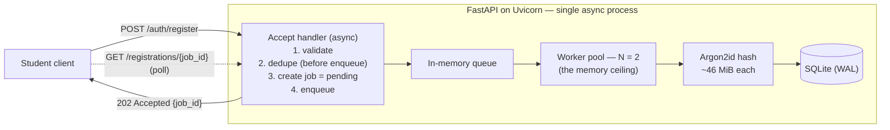
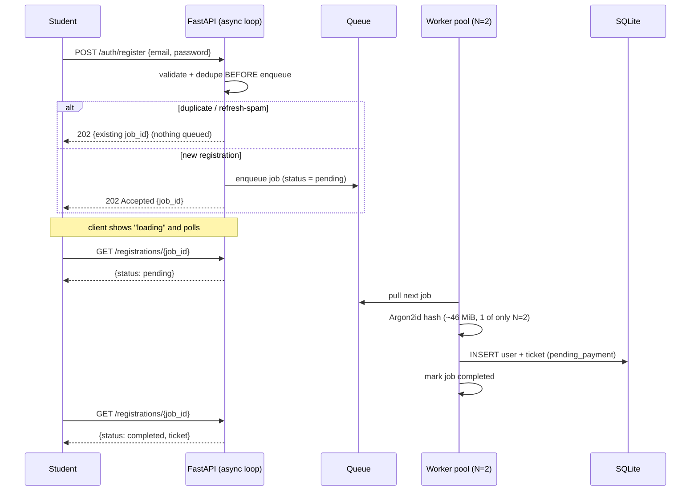

# SCALE.md — Surviving the Registration Spike

> **The question.** Registrations open Friday at 6:00 PM. We expect **2,000 students to hit the
> registration endpoint within the first 60 seconds**. The server has **1 GB of RAM**. What is one
> concrete strategy to keep the server stable during this spike?

---

## TL;DR

**Bound the number of password hashes that run at the same time.**

The thing that crashes a 1 GB server here is **not** the request count — it is **memory**, and the
memory comes from one operation: hashing the password. We hash with **Argon2id**, which is
*deliberately memory-hard* (~46 MiB per call). So if many hashes run at once, RAM — not CPU, not
bandwidth — is what runs out.

The strategy, in one sentence: **accept every request instantly on an async server, drop duplicates
before they cost anything, queue the rest, and process them with a small fixed pool of workers
(N ≈ 2) so peak memory is a constant that never approaches 1 GB.**

---

## 1. Why the naive version crashes (find the real bottleneck first)

`2,000 requests / 60 s = ~33 requests per second` on average. **That throughput is trivial** — a
single process handles it without noticing. Throughput is a red herring.

The real cost is in the registration handler: **hashing the password.**

> **The load-bearing fact: this entire strategy is conditional on the hash being _memory-hard_.**
> We use **Argon2id** (the OWASP-recommended password hash). It is *designed* to consume a large,
> fixed block of RAM per call (~46 MiB) so that brute-forcing is expensive. That same property is
> what makes concurrency dangerous on a small box.
>
> If we instead used **bcrypt** (~4 KiB per call, **not** memory-hard), the bottleneck would be
> **CPU**, not RAM, and a different strategy would apply. Naming the algorithm is not a detail — it
> is the premise of the whole answer.

Two ways the naive design dies, both before a single ticket is created:

| Naive choice | What happens under 2,000 concurrent requests | Result |
| --- | --- | --- |
| Hash inside the request, unbounded | `2,000 × 46 MiB ≈ 92 GB` of RAM demanded | Instant OOM kill |
| Thread-per-request server (sync/WSGI) | `2,000 threads × ~8 MiB stack ≈ 16 GB` | OOM *before* hashing even starts |

So two separate things must be controlled: **(a) how many hashes run at once**, and **(b) how
concurrent connections are held in memory.**

---

## 2. The strategy — a bounded async pipeline

Four design decisions. Each one is tied to the specific failure it prevents.

### Decision 1 — The server is async (stated as an explicit assumption)

The API runs on an **async ASGI server: Uvicorn + FastAPI**. The accept path is fully non-blocking,
so thousands of concurrent connections live on one event loop at **~KB each**, not a thread each.

- **Failure it prevents:** a synchronous thread-per-request server would park 2,000 OS threads
  (~8 MiB stack each ≈ 16 GB) and OOM before any work happens. **"Accept everyone instantly" is only
  memory-safe because the server is async.**
- The CPU/memory-heavy Argon2id call is **never run on the event loop** — it is offloaded to the
  bounded worker pool (Decision 3), so the loop stays responsive and keeps accepting.

### Decision 2 — Deduplicate *before* enqueue

On the accept path, before any work, we check: *is there already a pending or completed registration
for this email?* If yes, we return the existing `job_id` and **do not enqueue**.

- **Failure it prevents:** every queued job is a **~46 MiB liability** waiting to be processed. If a
  student refreshes 50 times — or an attacker scripts it — de-duping *after* the queue means 50 ×
  46 MiB of queued work. **Refresh-spam becomes a memory-amplification DoS.** De-duping on accept
  turns a refresh into a no-op.
- Backed by a **`UNIQUE` constraint on email** in the database (the correctness backstop) and a
  **per-IP rate limit** (the abuse backstop).

### Decision 3 — A bounded worker pool (the memory ceiling), with N *derived*, not guessed

A fixed pool of **N workers** is the **only** place Argon2id runs. `N` is derived from the two hard
limits of the machine:

| Constraint | Calculation | Value |
| --- | --- | --- |
| **RAM-bound** | usable RAM for hashing ÷ RAM per hash → `~450 MB ÷ 46 MiB` | ≈ **9** |
| **CPU-bound** | Argon2id pins ~1 core per call; a 1 GB instance has ~1–2 (often shared) vCPUs | ≈ **2** |
| **N = min(RAM-bound, CPU-bound)** | `min(9, 2)` | **2** |

(The "~450 MB usable" is what's left after OS + Python + Uvicorn + SQLite ≈ 250–350 MB and a safety
reserve.) On a box with **2 dedicated cores**, load-test `N = 3–4`. The binding limit is **cores**,
not RAM — *once concurrency is bounded.* Unbounded, RAM is what kills you first.

> **Peak hashing memory = `N × 46 MiB = ~92 MiB` — a constant.**
> Whether 2,000 or 200,000 people arrive, only N hashes ever exist at once. A fixed memory ceiling,
> far below 1 GB, is the literal definition of "stable."

### Decision 4 — Queue + `202 Accepted` + poll (absorb the burst, hide the wait)

- **Accept (fast path, every request):** validate → dedupe → create job (`pending`) → push to an
  in-memory queue → return **`202 Accepted { job_id }`** in milliseconds. No hashing here.
- **Process (slow path, only N at a time):** a worker pulls a job → Argon2id hash → write user +
  ticket to SQLite (WAL mode, single writer) → mark job `completed`.
- **Client:** polls `GET /registrations/{job_id}` until `completed`. This poll **is** the "loading
  screen" — the user is never shown an error, just a brief wait.
- **Safety valve:** if the queue length exceeds a sane cap, return `503 Retry-After`. At this scale
  it never fires; it exists so a 10× surprise *degrades gracefully* instead of OOM-ing.

---

## 3. Diagrams

### Architecture / data flow

### Request lifecycle

---

## 4. What actually happens on Friday at 6:00 PM

| Property | Behaviour |
| --- | --- |
| **Acceptance latency** | Milliseconds for all 2,000. The server stays responsive the entire spike. |
| **Dropped requests** | Zero. Everyone gets a `job_id`. |
| **Peak memory** | Flat ceiling ≈ baseline + `N × 46 MiB` ≈ **~92 MiB of hashing** — never near 1 GB. |
| **Completion (drain)** | Throughput ≈ `N ÷ hash_time` ≈ `2 ÷ ~80 ms` ≈ **~25 registrations/s**. Worst case (all 2,000 in second 1) the tail finishes in **~80 s**; realistically, arrivals spread across the minute and most finish within seconds. |

> **The key distinction: acceptance is instant; completion is _eventual_.**
> The question asks us to keep the server **stable**. A server that stays up, drops nothing, holds a
> flat memory ceiling, and finishes everyone within ~a minute is a win. The alternative — a naive
> handler that crashes at second 3 — serves *nobody*. Stability ≠ instantaneous completion, and
> because registration is decoupled from payment (a separate later step), a short processing delay
> is invisible in the real user journey.

---

## 5. The tuning dial (the trade-off, stated honestly)

Argon2id's memory parameter `m` is a dial between **password security** and **drain speed**:

| `m` per hash | Security | Throughput @ N=2 | Worst-case tail |
| --- | --- | --- | --- |
| 46 MiB (chosen, OWASP max-memory profile) | Strongest | ~25/s | ~80 s |
| 19 MiB (OWASP floor, still memory-hard) | Strong | ~3–4× faster | ~25 s |

For a student tech fest I'd run `m = 32–46 MiB`; for high-value data I'd raise it and accept a slower
drain. **The architecture does not change — only the constant moves.**

---

## 6. If traffic grew 10× (what I'd add next)

- **Durable queue** (Redis + RQ/Celery) so pending jobs survive a restart — costs ~100 MB RAM, a
  deliberate trade that is *not* worth it on a 1 GB box today.
- **Horizontal scale:** multiple app instances behind a load balancer. The accept path is already
  stateless, so this is mostly configuration.
- **Dedicated hashing workers** on separate machines, so the API box never does CPU-heavy work.

> **Not Kubernetes — not here.** On a single 1 GB server the K8s control plane alone (etcd,
> api-server, kubelet) would exceed the available RAM. Orchestration earns its keep only when there
> are real nodes to orchestrate. The constraint here is *vertical efficiency on fixed hardware*, and
> the answer above is built for exactly that.
