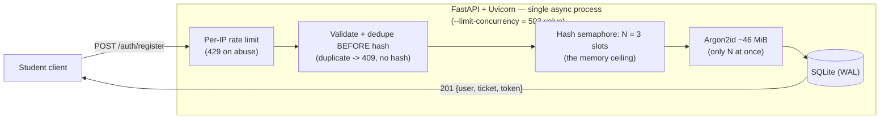
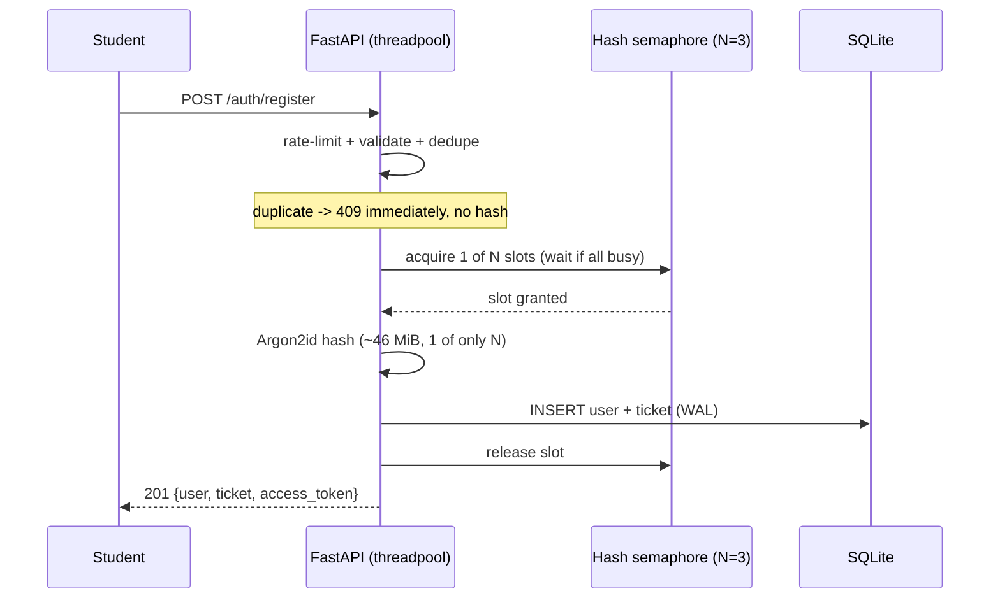

# SCALE.md — Surviving the Registration Spike

> **The question.** 2,000 students hit the registration endpoint within the first 60 seconds. The
> server has 1 GB of RAM. What is one concrete strategy to keep it stable during the spike?

This describes the strategy **as implemented in this codebase** (file references throughout), plus
the path I'd take if traffic grew well beyond this.

## Assumptions

- **Hardware:** 1 GB RAM, **~2 vCPU** (typical small cloud instance; often burstable/shared).
- **Password hash:** **Argon2id** (`m = 46 MiB, t = 1, p = 1` — `app/config.py`) → ~46 MiB **and**
  ~one core per call, **cost ≈ 80 ms** (confirm by load-test on the target box).
- **Server:** async ASGI — **FastAPI + Uvicorn**, single process.
- **Baseline footprint:** OS + Python + Uvicorn + SQLite ≈ 250–350 MB, leaving **~450 MB for hashing**.

## TL;DR

The bottleneck on 1 GB is **memory**, and it comes from one place: the **memory-hard** Argon2id
hash (~46 MiB per call). The implemented strategy: **cap how many hashes run at once with a semaphore
(N = 3) so peak RAM is a fixed ceiling**, skip hashing entirely for duplicates, and shed gracefully
at the edges. The server's memory never exceeds *baseline + N × 46 MiB*, so it stays up through the
spike instead of OOM-ing.

---

## 1. The real bottleneck

`2,000 / 60 s ≈ 33 req/s` — trivial throughput. The cost is **hashing the password**.

> The thesis depends on the hash being **memory-hard**: Argon2id allocates ~46 MiB per call *by
> design*. bcrypt (~4 KiB) would make this CPU-bound instead — a different problem.

Unbounded, the naive handler dies before creating a ticket: `2,000 × 46 MiB ≈ 92 GB` of RAM
demanded → instant OOM. So the one thing that must be controlled is **how many hashes run at once.**

---

## 2. The implemented strategy

Five layers, each tied to the file that implements it.

**1 — Async server, hashing off the event loop.** FastAPI runs the sync register route in a worker
threadpool, so the event loop is never blocked by a hash and the process keeps accepting connections.

**2 — Bounded Argon2id concurrency = the memory ceiling.** `app/security.py` wraps every
`hash()`/`verify()` in `threading.BoundedSemaphore(HASH_CONCURRENCY)`. Only **N** hashes ever run at
once, so **peak hashing RAM = N × 46 MiB — a constant, for any arrival rate.** N is derived, not guessed:

| Limit | Calc | Value |
| --- | --- | --- |
| RAM-bound | `~450 MB ÷ 46 MiB` | ≈ 9 |
| CPU-bound | `cores + 1` (Argon2id pins ~1 core/call) | 3 |
| **N = min(RAM, CPU)** | `min(9, 3)` | **3** |

→ peak hashing RAM ≈ **138 MiB**, far below 1 GB. (A semaphore of size N is the same memory cap as a
"worker pool of N" — just expressed without an explicit queue.)

**3 — Dedupe before the hash.** `app/services/registration.py` checks the email first and returns
`409` **without hashing** if it exists. So a refresh-spamming user (or a scripted duplicate flood)
never triggers the expensive memory-hard hash — duplicates cost ~nothing. Backed by a `UNIQUE` email
constraint and a per-IP **rate limit** (`app/ratelimit.py`, 30/min register → `429`).

**4 — Graceful load-shedding at the edges (shed, don't crash).** Two valves return a clean response
instead of letting work pile up unbounded: the per-IP rate limit (`429`), and Uvicorn's
**`--limit-concurrency`** (set to 200 in the `Dockerfile` / `make run-prod`) which returns `503`
beyond a fixed number of simultaneous connections.

**5 — Safe DB under concurrency.** `app/database.py` enables **WAL**, `foreign_keys`, and a
`busy_timeout`; writes use **atomic conditional UPDATEs** (payment confirm, check-in) and an atomic
seat counter — so no "database is locked", no oversell, no double check-in under load.

---

## 3. The registration path

---

## 4. What happens on Friday at 6:00 PM

| Property | Behaviour |
| --- | --- |
| Peak memory | baseline + `N × 46 MiB` ≈ **~138 MiB of hashing** — never near 1 GB; **no OOM** |
| Concurrency | only N hashes at once; extra requests wait for a slot. Open connections are ~KB each, so thousands waiting cost a few MB |
| Throughput | cores-bound ≈ `cores ÷ hash_time ≈ 2 ÷ 80 ms ≈ 25/s` |
| Slowest registrant | spread over the minute → tail **~20 s**; pathological all-at-once burst → ~80 s |
| Duplicates / abuse | deduped or rate-limited **before** they cost a hash |

The server stays up, drops nothing it accepts, and holds a flat memory ceiling — which is exactly
what "keep it stable" asks. **The trade-off:** registration is synchronous, so a client holds its
connection open while waiting for the `201`. That's fine at this scale; the one weakness is that in a
*pathological* instant burst the tail wait (~80 s) could exceed a client/proxy timeout — which is
precisely what the §6 async-queue evolution removes.

---

## 5. Tuning dial

Argon2id's `m` trades password security for drain speed; **the architecture is unchanged**:

| `m` per hash | Security | Throughput @ N=3 |
| --- | --- | --- |
| 46 MiB (chosen, `config.py`) | strongest | ~25/s |
| 19 MiB (OWASP floor, still memory-hard) | strong | ~3–4× faster |

---

## 6. If traffic grew well beyond this

- **Async queue + `202` + poll — implemented (additive).** `POST /auth/register-async` accepts
  instantly and returns a `job_id`; a bounded worker pool (`app/jobs.py`, size = `HASH_CONCURRENCY`)
  drains an in-memory queue using the *same* hash semaphore, and clients poll
  `GET /auth/register/status/{job_id}`. The synchronous `/auth/register` stays the default. Same
  memory ceiling, but this path frees the connection and removes the synchronous-tail weakness above.
- **Durable queue** (Redis + RQ/Celery) so pending jobs survive a restart — ~100 MB RAM, not worth
  it at 1 GB today.
- **Scale out:** more app processes behind a load balancer (the accept path is stateless). More
  processes = more cores = faster drain — the right lever, since one process is CPU-bound at its cores.
- **Not Kubernetes here** — its control plane alone would exceed 1 GB. Orchestration pays off only
  when there are real nodes to orchestrate; this problem is vertical efficiency on fixed hardware.

---

## 7. How to verify

- **Race-safety** is proven by `tests/test_concurrency.py` — it fires simultaneous duplicate
  registrations, double check-ins, and last-seat payments and asserts exactly one winner:
  `pytest -k concurrency`.
- **Memory ceiling** is observable: set a high `ARGON2_MEMORY_COST` and a low `HASH_CONCURRENCY`,
  fire a concurrent burst, and watch the process RSS plateau at ≈ `baseline + N × m` — it stays flat
  no matter how many requests pile up.
- **Load test:** point `hey`/`wrk` at `/auth/register` (vary the email per request). Throughput caps
  at ≈ `cores ÷ hash_time` and latency grows under load, while memory stays bounded and the server
  never crashes — exactly the behaviour described above.
